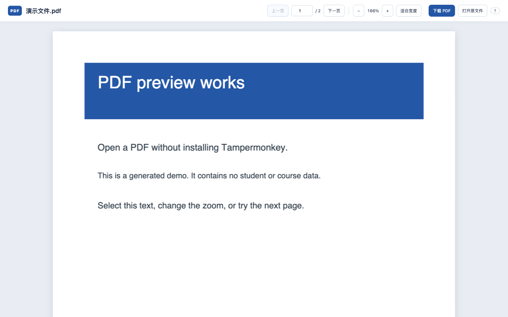

# 复旦 eLearning PDF 预览 · 独立插件版

在 eLearning 作业页面点击 PDF 文件名即可阅读，适用于网站提示“没有预览可用于此文件”的情况。本项目与复旦大学及其 eLearning 平台无官方关联。

本项目保留两个版本，分别维护，不合并代码：

- **独立插件版（当前分支）**：无需 Tampermonkey，推荐 Edge 用户[从微软商店安装](https://microsoftedge.microsoft.com/addons/detail/ibgcgppobifaogaodeimafhpmoonioch)。
- **油猴脚本版（`main` 分支）**：[查看脚本版及安装说明](https://github.com/sjy0630/fudan-elearning-pdf-preview/tree/main)，需要 Tampermonkey。

请选择其中一种使用，避免同时启用两个版本。

## 独立扩展：免 Tampermonkey

点击 PDF 文件名后，在新标签页打开自带阅读器。支持翻页、页码跳转、缩放、适合宽度、选择文字和下载，不依赖浏览器原生 PDF 预览设置。

安装后也可以先点击“体验示例 PDF”：示例随扩展打包，无需学校账号或网络，就能体验翻页、缩放和文字选择。



### Edge 商店安装（推荐）

**Edge 版已上架 Microsoft Edge Add-ons，无需油猴、开发者模式或手动解压。**

1. 用 Edge 打开[官方商店安装页](https://microsoftedge.microsoft.com/addons/detail/ibgcgppobifaogaodeimafhpmoonioch)，点击“获取”并确认添加扩展。
2. 如果安装过同名油猴脚本或手动加载的测试版扩展，请先停用旧版。
3. 在同一浏览器登录复旦 eLearning，刷新已打开的课程页面，点击 PDF 文件名即可阅读。

商店上架不代表所有课程文件或网络环境均已验证；真实课程访问与国内普通网络的安装体验仍需进一步实测。

### Chrome / Edge 手动安装（开发测试）

Chrome 和 Edge 使用同一个 Chromium 包；Firefox 使用单独的包。普通 Edge 用户优先选择上方商店安装。

1. 获取 `fudan-elearning-pdf-preview-chromium-1.1.0.zip` 并解压到一个长期保留的文件夹。
2. Chrome 打开 `chrome://extensions`；Edge 打开 `edge://extensions`。开启“开发者模式”，点击“加载已解压的扩展”，选择包含 `manifest.json` 的文件夹。
3. 登录 eLearning、刷新作业页面，然后点击 PDF 文件名。

只需第一次安装时执行上述步骤。手动安装的版本不会通过商店自动更新；更换版本后需在扩展管理页点击刷新。如果以前安装过同名 Tampermonkey 脚本，请先停用旧脚本，避免重复预览。

### Firefox

Firefox 正式版需要 Mozilla 签名后的扩展才能长期安装，未签名 ZIP 不能作为面向普通用户的安装方式。开发测试可在 `about:debugging#/runtime/this-firefox` 点击“临时载入附加组件”，选择解压包中的 `manifest.json`；浏览器重启后需要重新载入。Firefox 包最低版本为 142。面向普通用户的安装链接将在签名和审核完成后补充。

### 文件与权限

PDF 直接从学校或学校指定的文件服务器读取，并在浏览器里处理；不上传到第三方预览服务。默认网站权限仅覆盖 eLearning。如果学校把文件转到其他服务器，阅读器会在需要时显示目标域名，点击后只申请该域名的访问权限。

文件上限为 100 MiB。预览仍会传输文件数据，但不会主动保存到下载目录。扫描 PDF 没有文字层时，不能直接选择文字。

详见[隐私说明](docs/PRIVACY.md)和[商店提交材料](docs/STORE-LISTING.md)。

### 从源码构建

需要 Node.js 22.13.0 或更高版本（推荐 Node.js 24）；不需要另装 ZIP 工具，Windows、macOS、Linux 使用相同的构建命令：

```sh
npm ci --ignore-scripts --omit=optional
npm test
npm run check
npm run build
npm run verify:packages
```

两个浏览器版本与安装 ZIP 位于 `dist/`，每次构建自动生成对应的 `SHA256SUMS.txt` 校验文件。阅读器代码、worker、字体和图片解码资源都随扩展打包，不从远程 CDN 获取执行代码。PDF.js 固定版本及完整性保存在锁文件中，许可证随包提供。

自动检查会在 Linux Chromium 与 Windows Edge 中加载扩展、运行模拟课程和离线示例，并保留截图与结果。它还会比较两个系统生成的安装包校验值。检查包只用于测试，不是商店签名安装包。开发者可运行 `npx playwright install chromium` 后执行 `npm run test:browser`；测试使用隔离配置，不读取日常浏览器账号。构建和安装开发依赖需要联网，普通用户安装后的阅读器不依赖这些开发工具。

当前已在 macOS 的 Chromium 155 / Edge 154 / 官方 Firefox 156，以及自动检查环境的 Linux Chromium 153 / Windows Server 2025 Edge 153 中加载独立扩展，验证模拟作业页的 PDF 渲染、翻页、缩放、主动下载、权限失效和跨服务器授权提示。[首次跨系统检查全部通过](https://github.com/sjy0630/fudan-elearning-pdf-preview/actions/runs/36545334728)，Windows 与 Linux 安装包校验值一致。尚未替代真实登录课程文件、普通用户设备以及商店签名安装的最终验证。详见[验证记录](docs/VALIDATION.md)。

后续功能按[迭代路线图](docs/ROADMAP.md)推进，当前优先解决免油猴和安装便利性。

## 原版用户脚本：安装

1. 确认 Chrome 中已安装并启用 Tampermonkey。
2. 点击[安装用户脚本](https://raw.githubusercontent.com/sjy0630/fudan-elearning-pdf-preview/main/elearning-pdf-preview.user.js)，在 Tampermonkey 的安装页面确认。
3. 重新加载 `elearning.fudan.edu.cn` 的作业页面。

也可以在 Tampermonkey 中选择“添加新脚本”，把 [`elearning-pdf-preview.user.js`](elearning-pdf-preview.user.js) 的完整内容粘贴到编辑器并保存。脚本元数据包含更新地址，安装后可接收后续版本。

脚本仅在 `https://elearning.fudan.edu.cn/` 运行。Tampermonkey 元数据中的 `@connect *` 用于处理学校文件服务的跨域重定向；代码只会向当前 eLearning 站点的文件下载地址发起初始请求，不会把 PDF 发给其他自选服务。

## 原版用户脚本：使用

- 点击 PDF 文件名，弹窗会读取并显示 PDF。点击页面原有的下载图标仍按网站原行为处理。
- 点击弹窗的“下载 PDF”才会主动保存文件。点“关闭”、弹窗外部或按 Escape 可返回页面。
- 如果预览失败，弹窗会给出原因，并提供“打开原文件”和“下载 PDF”入口。
- Ctrl/⌘ 点击等浏览器常见的新标签页操作仍按原行为处理。

预览仍需从网站传输文件数据到浏览器，只是不主动保存到“下载”目录。浏览器自身可能使用缓存。

## 验证

在项目目录运行：

```sh
node --check elearning-pdf-preview.user.js
node --test tests/userscript.test.cjs
```

脚本的本地测试覆盖了 Canvas 文件链接的识别、下载按钮排除、普通链接排除及跨域重定向后的读取回退。由于不同课程的文件权限和文件服务可能不同，请在自己有权限访问的 PDF 上验证。

## 许可

本项目以 [MIT 许可证](LICENSE)发布。

## Star 历史

两个版本属于同一个仓库，下图展示整个项目的 Star 增长趋势。

[](https://www.star-history.com/#sjy0630/fudan-elearning-pdf-preview&Date)

图表由第三方 Star History 服务生成，可能存在缓存延迟；若图片未加载，可点击查看图表页面。
