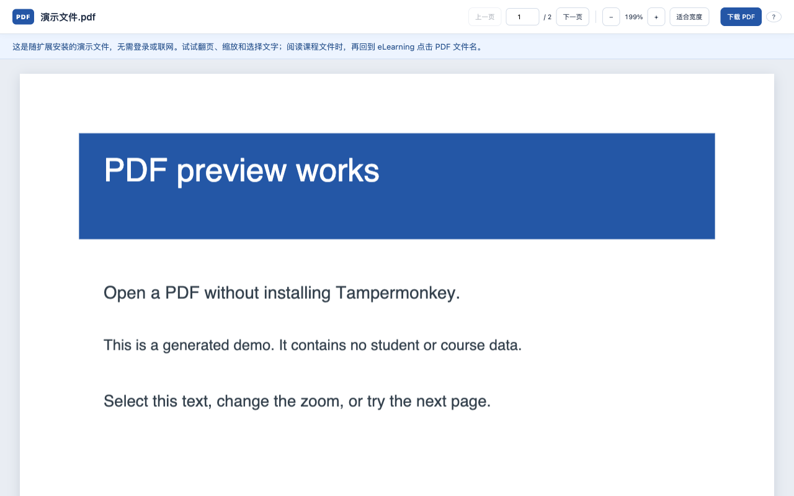

# 无学校账号的审核与试用

扩展包含一个生成的两页演示 PDF，可用于检查阅读器，无需学校账号或访问学校服务器。

1. 安装提交包后，欢迎页会自动打开。也可点击扩展按钮，再打开“使用帮助与隐私说明”。
2. 点击“先体验示例 PDF”。阅读页上方会明确说明正在显示内置演示文件。
3. 尝试“下一页”、输入页码、缩放和选择文字。点击“下载 PDF”只会下载这个生成的演示文件。
4. 可以断开网络后重新打开示例。PDF、阅读器、worker 和字体均已打包，不需要 CDN。

演示模式只读取固定的扩展内置 `demo.pdf`，不能通过查询参数指定其他文件或网址。它不申请学校或额外文件服务器的权限，不读取浏览记录，也不含任何私人课程资料。

真实课程流程：用户在同一个浏览器登录复旦 eLearning，在有权限访问的课程页面点击 PDF 文件名。网站原有下载按钮和 Ctrl/⌘ 点击不受影响。若学校重定向到其他文件服务器，只有在需要且用户点击授权后才申请该域名的权限。有关模拟课程流程的验证记录见 [VALIDATION.md](VALIDATION.md)。

请不要为审核共享学生账号、密码、真实课程文件或含授权参数的文件链接。内置演示证明阅读器功能可用，不替代真实学校登录及课程权限的验证。
